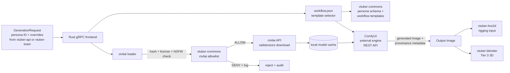

# System Architecture

## 🏗️ High-Level Overview
vtuber-image wraps ComfyUI behind a typed gRPC surface. It is explicitly NOT a ComfyUI fork — upstream ComfyUI runs as an external engine and we call it over REST. On each GenerationRequest (carrying a persona ID from vtuber-commons plus optional overrides), the service loads the matching curated workflow.json template, feeds it to ComfyUI, and returns the generated image with provenance metadata. Required models are downloaded from civitai through an allowlist loader that verifies hash, license, and NSFW tags against vtuber-commons before every load — preventing pickle/LoRA supply-chain attacks. Characters ship as versioned workflow.json templates alongside vtuber-commons persona schemas, so base image and persona stay in sync.

## 🗺️ Component Diagram

## 🛠️ Technology Stack
- **Programming Languages:** Rust, Python
- **Tooling & Infrastructure:** tonic (gRPC frontend), ComfyUI (external engine, called via REST — never forked), civitai API (community model loader), Flux dev q8 + SDXL (diffusion backbones), PyTorch (model runtime), CUDA 12.1+ (8-14 GB VRAM)
- **Core Pattern:** Wrap, do not fork (ComfyUI is called over REST — we never diverge from upstream)
- **Strategy:** ComfyUI as external engine (REST). civitai loader enforces allowlist from vtuber-commons (hash, license, NSFW). Workflow.json templates ship alongside persona schemas so base image and persona stay version-locked.

## 🔗 Internal References
- Engineering rules: [PRINCIPLES.md](PRINCIPLES.md)
- Live project map: [STRUCTURE.tree](STRUCTURE.tree)
